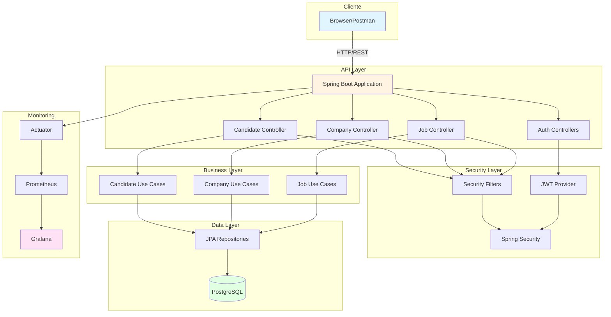
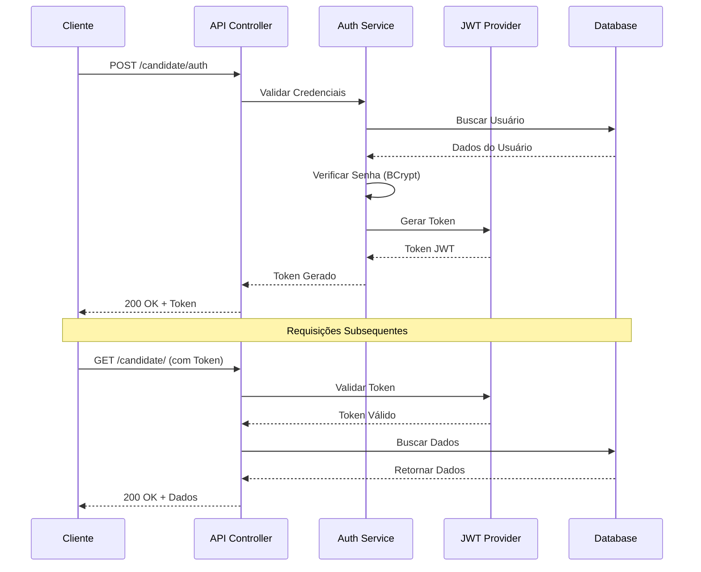

<div align="center">

# 🚀 Job Platform

### Plataforma de Gestão de Vagas e Candidatos

[](https://www.oracle.com/java/)
[](https://spring.io/projects/spring-boot)
[](https://www.postgresql.org/)
[](https://www.docker.com/)
[]([LICENSE](https://github.com/patrick-cuppi/job-platform/blob/main/LICENSE))

[Recursos](#-recursos) •
[Tecnologias](#-tecnologias) •
[Arquitetura](#-arquitetura) •
[Instalação](#-instalação) •
[API](#-api-endpoints) •
[Monitoramento](#-monitoramento)

</div>

---

## 📋 Sobre o Projeto

**Job Platform** é uma API REST robusta e escalável desenvolvida com Spring Boot para gerenciar processos de recrutamento e seleção. A plataforma conecta empresas que desejam divulgar vagas com candidatos em busca de oportunidades profissionais, oferecendo um sistema completo de autenticação, autorização e gestão de candidaturas.

### 🎯 Principais Funcionalidades

- **Gestão de Candidatos**: Cadastro, autenticação e perfil personalizado
- **Gestão de Empresas**: Registro de empresas e criação de vagas
- **Sistema de Vagas**: Publicação, busca filtrada e aplicação para vagas
- **Autenticação JWT**: Segurança baseada em tokens para candidatos e empresas
- **Documentação Interativa**: Interface Swagger/OpenAPI para testes de API
- **Monitoramento**: Integração com Prometheus e Grafana para métricas em tempo real

---

## 🛠 Tecnologias

### Core Framework
- **Java 17** - Linguagem de programação
- **Spring Boot 3.5.8** - Framework principal
- **Spring Data JPA** - Camada de persistência
- **Spring Security** - Autenticação e autorização
- **Spring Validation** - Validação de dados

### Banco de Dados
- **PostgreSQL** - Banco de dados relacional principal
- **H2 Database** - Banco em memória para testes

### Segurança
- **JWT (java-jwt 4.4.0)** - JSON Web Tokens para autenticação
- **BCrypt** - Criptografia de senhas

### Documentação
- **SpringDoc OpenAPI 3** - Documentação automática da API
- **Swagger UI** - Interface interativa para testes

### DevOps & Monitoramento
- **Docker & Docker Compose** - Containerização
- **Prometheus** - Coleta de métricas
- **Grafana** - Visualização de métricas
- **Spring Boot Actuator** - Endpoints de monitoramento

### Qualidade de Código
- **JUnit** - Testes unitários
- **Spring Security Test** - Testes de segurança
- **JaCoCo** - Cobertura de testes
- **SonarQube** - Análise de qualidade de código

### Utilitários
- **Lombok** - Redução de boilerplate
- **Maven** - Gerenciamento de dependências

---

## 🏗 Arquitetura

### Diagrama de Componentes



### Fluxo de Autenticação



---

## 📦 Instalação

### Pré-requisitos

Antes de começar, certifique-se de ter instalado:

| Ferramenta | Versão Mínima | Documentação |
|------------|---------------|--------------|
| **Java JDK** | 17+ | [Download](https://www.oracle.com/java/technologies/downloads/) |
| **Maven** | 3.6+ | [Download](https://maven.apache.org/download.cgi) |
| **Docker** | 20.10+ | [Download](https://docs.docker.com/get-docker/) |
| **Docker Compose** | 2.0+ | [Download](https://docs.docker.com/compose/install/) |
| **PostgreSQL** | 12+ (opcional) | [Download](https://www.postgresql.org/download/) |

### Verificar Instalações

```bash
# Verificar Java
java -version

# Verificar Maven
mvn -version

# Verificar Docker
docker --version
docker-compose --version
```

---

## 🚀 Como Executar

### Opção 1: Execução com Docker (Recomendado)

#### 1. Clone o repositório
```bash
git clone https://github.com/patrick-cuppi/job-platform
cd job_platform
```

#### 2. Inicie os serviços com Docker Compose
```bash
# Iniciar PostgreSQL, Prometheus e Grafana
docker-compose up -d

# Verificar se os containers estão rodando
docker-compose ps
```

#### 3. Compile e execute a aplicação
```bash
# Compilar o projeto
mvn clean install -DskipTests

# Executar a aplicação
mvn spring-boot:run
```

#### 4. Acesse a aplicação
- **API**: http://localhost:8080
- **Swagger UI**: http://localhost:8080/swagger-ui.html
- **Prometheus**: http://localhost:9090
- **Grafana**: http://localhost:3000

---

### Opção 2: Execução com Docker Build

#### 1. Build da imagem Docker
```bash
# Construir a imagem
docker build -t job-platform:latest .
```

#### 2. Executar o container
```bash
# Criar rede Docker (se não existir)
docker network create job_platform_network

# Executar PostgreSQL
docker run -d \
  --name job_platform_db \
  --network job_platform_network \
  -e POSTGRES_DB=job_platform \
  -e POSTGRES_USER=admin \
  -e POSTGRES_PASSWORD=admin \
  -p 5432:5432 \
  postgres:latest

# Executar a aplicação
docker run -d \
  --name job_platform_app \
  --network job_platform_network \
  -p 8080:8080 \
  -e DATABASE_URL=jdbc:postgresql://job_platform_db:5432/job_platform \
  -e DATABASE_USERNAME=admin \
  -e DATABASE_PASSWORD=admin \
  job-platform:latest
```

---

### Opção 3: Execução Local (Sem Docker)

#### 1. Configurar PostgreSQL Local
```sql
-- Conectar ao PostgreSQL e criar o banco
CREATE DATABASE job_platform;
CREATE USER admin WITH PASSWORD 'admin';
GRANT ALL PRIVILEGES ON DATABASE job_platform TO admin;
```

#### 2. Configurar variáveis de ambiente (opcional)
```bash
export DATABASE_URL=jdbc:postgresql://localhost:5432/job_platform
export DATABASE_USERNAME=admin
export DATABASE_PASSWORD=admin
```

#### 3. Executar a aplicação
```bash
mvn spring-boot:run
```

---

## 📚 API Endpoints

### 🔐 Autenticação

#### Candidato

<details>
<summary><strong>POST</strong> <code>/candidate/auth</code> - Autenticar Candidato</summary>

**Request Body:**
```json
{
  "username": "joao.silva",
  "password": "senha123"
}
```

**Response (200 OK):**
```json
{
  "access_token": "eyJhbGciOiJIUzI1NiIsInR5cCI6IkpXVCJ9...",
  "expires_in": 7200
}
```
</details>

#### Empresa

<details>
<summary><strong>POST</strong> <code>/company/auth</code> - Autenticar Empresa</summary>

**Request Body:**
```json
{
  "username": "empresa@email.com",
  "password": "senha123"
}
```

**Response (200 OK):**
```json
{
  "access_token": "eyJhbGciOiJIUzI1NiIsInR5cCI6IkpXVCJ9...",
  "expires_in": 7200
}
```
</details>

---

### 👤 Candidatos

<details>
<summary><strong>POST</strong> <code>/candidate/</code> - Criar Candidato</summary>

**Request Body:**
```json
{
  "name": "João Silva",
  "username": "joao.silva",
  "email": "joao@email.com",
  "password": "senha123",
  "description": "Desenvolvedor Full Stack com 5 anos de experiência",
  "curriculum": "https://meu-cv.com/joao"
}
```

**Response (200 OK):**
```json
{
  "id": "uuid-do-candidato",
  "name": "João Silva",
  "username": "joao.silva",
  "email": "joao@email.com",
  "description": "Desenvolvedor Full Stack com 5 anos de experiência",
  "curriculum": "https://meu-cv.com/joao",
  "createdAt": "2025-12-30T10:30:00"
}
```
</details>

<details>
<summary><strong>GET</strong> <code>/candidate/</code> - Obter Perfil do Candidato 🔒</summary>

**Headers:**
```
Authorization: Bearer {token}
```

**Response (200 OK):**
```json
{
  "id": "uuid-do-candidato",
  "name": "João Silva",
  "username": "joao.silva",
  "email": "joao@email.com",
  "description": "Desenvolvedor Full Stack com 5 anos de experiência"
}
```
</details>

<details>
<summary><strong>GET</strong> <code>/candidate/job?filter=java</code> - Buscar Vagas 🔒</summary>

**Headers:**
```
Authorization: Bearer {token}
```

**Query Parameters:**
- `filter` (string): Termo de busca para filtrar vagas

**Response (200 OK):**
```json
[
  {
    "id": "uuid-da-vaga",
    "description": "Desenvolvedor Java Senior",
    "benefits": "Vale alimentação, plano de saúde",
    "level": "SENIOR",
    "companyId": "uuid-da-empresa",
    "createdAt": "2025-12-30T10:30:00"
  }
]
```
</details>

<details>
<summary><strong>POST</strong> <code>/candidate/job/apply</code> - Candidatar-se a Vaga 🔒</summary>

**Headers:**
```
Authorization: Bearer {token}
```

**Request Body:**
```json
"uuid-da-vaga"
```

**Response (200 OK):**
```json
{
  "id": "uuid-da-aplicacao",
  "candidateId": "uuid-do-candidato",
  "jobId": "uuid-da-vaga",
  "createdAt": "2025-12-30T10:30:00"
}
```
</details>

---

### 🏢 Empresas

<details>
<summary><strong>POST</strong> <code>/company/</code> - Criar Empresa</summary>

**Request Body:**
```json
{
  "username": "empresa@email.com",
  "email": "contato@empresa.com",
  "password": "senha123",
  "website": "https://empresa.com",
  "name": "Tech Solutions LTDA",
  "description": "Empresa de tecnologia especializada em soluções cloud"
}
```

**Response (200 OK):**
```json
{
  "id": "uuid-da-empresa",
  "username": "empresa@email.com",
  "email": "contato@empresa.com",
  "website": "https://empresa.com",
  "name": "Tech Solutions LTDA",
  "description": "Empresa de tecnologia especializada em soluções cloud",
  "createdAt": "2025-12-30T10:30:00"
}
```
</details>

---

### 💼 Vagas

<details>
<summary><strong>POST</strong> <code>/company/job/</code> - Criar Vaga 🔒</summary>

**Headers:**
```
Authorization: Bearer {token}
```

**Request Body:**
```json
{
  "description": "Desenvolvedor Java Senior",
  "benefits": "Vale alimentação, plano de saúde, home office",
  "level": "SENIOR"
}
```

**Response (200 OK):**
```json
{
  "id": "uuid-da-vaga",
  "description": "Desenvolvedor Java Senior",
  "benefits": "Vale alimentação, plano de saúde, home office",
  "level": "SENIOR",
  "companyId": "uuid-da-empresa",
  "createdAt": "2025-12-30T10:30:00"
}
```
</details>

<details>
<summary><strong>GET</strong> <code>/company/job/</code> - Listar Vagas da Empresa 🔒</summary>

**Headers:**
```
Authorization: Bearer {token}
```

**Response (200 OK):**
```json
[
  {
    "id": "uuid-da-vaga",
    "description": "Desenvolvedor Java Senior",
    "benefits": "Vale alimentação, plano de saúde",
    "level": "SENIOR",
    "companyId": "uuid-da-empresa",
    "createdAt": "2025-12-30T10:30:00"
  }
]
```
</details>

---

### 📝 Legenda

- 🔒 = Requer autenticação JWT

---

## 📊 Monitoramento

### Prometheus

Acesse: http://localhost:9090

Métricas disponíveis:
- `jvm_memory_used_bytes` - Uso de memória JVM
- `http_server_requests_seconds` - Tempo de resposta das requisições
- `system_cpu_usage` - Uso de CPU
- `jdbc_connections_active` - Conexões ativas do banco

### Grafana

Acesse: http://localhost:3000

**Credenciais padrão:**
- Usuário: `admin`
- Senha: `admin`

#### Configurar Dashboard:

1. Adicionar Data Source:
   - Configuration → Data Sources → Add Prometheus
   - URL: `http://prometheus:9090`

2. Importar Dashboard:
   - Dashboard ID: `4701` (JVM Micrometer)
   - Dashboard ID: `12900` (Spring Boot Statistics)

### Spring Boot Actuator

Endpoints disponíveis:

| Endpoint | Descrição |
|----------|-----------|
| `/actuator/health` | Status da aplicação |
| `/actuator/metrics` | Métricas disponíveis |
| `/actuator/prometheus` | Métricas formato Prometheus |

---

## 🧪 Testes

### Executar Testes

```bash
# Executar todos os testes
mvn test

# Executar com cobertura
mvn clean test jacoco:report

# Ver relatório de cobertura
open target/site/jacoco/index.html
```

### Análise de Qualidade (SonarQube)

```bash
# Executar análise
mvn clean verify sonar:sonar \
  -Dsonar.projectKey=job_platform \
  -Dsonar.host.url=http://localhost:9000 \
  -Dsonar.login=seu-token
```

---

## 🔧 Configurações

### Variáveis de Ambiente

| Variável | Descrição | Padrão |
|----------|-----------|--------|
| `DATABASE_URL` | URL de conexão PostgreSQL | `jdbc:postgresql://localhost:5432/job_platform` |
| `DATABASE_USERNAME` | Usuário do banco | `Ex: admin` |
| `DATABASE_PASSWORD` | Senha do banco | `Ex: admin` |
| `security.jwt.secret` | Secret para JWT de empresas | `Ex: 21&r21f@r05ew%6@qf10#ef5` |
| `security.jwt.secret.candidate` | Secret para JWT de candidatos | `Ex: 1$r5wr1g6f@r0w%6@qf10wef2` |

### Profiles

```bash
# Desenvolvimento (padrão)
mvn spring-boot:run

# Testes
mvn spring-boot:run -Dspring-boot.run.profiles=test
```

---

## 📁 Estrutura do Projeto

```
job_platform/
├── src/
│   ├── main/
│   │   ├── java/
│   │   │   └── br/com/patickcuppi/job_platform/
│   │   │       ├── config/              # Configurações (Swagger, etc)
│   │   │       ├── exceptions/          # Handlers de exceções
│   │   │       ├── modules/
│   │   │       │   ├── candidate/       # Módulo de candidatos
│   │   │       │   │   ├── controllers/
│   │   │       │   │   ├── dto/
│   │   │       │   │   ├── entities/
│   │   │       │   │   ├── repositories/
│   │   │       │   │   └── useCases/
│   │   │       │   └── company/         # Módulo de empresas
│   │   │       │       ├── controllers/
│   │   │       │       ├── dto/
│   │   │       │       ├── entities/
│   │   │       │       ├── repositories/
│   │   │       │       └── useCases/
│   │   │       ├── providers/           # JWT Providers
│   │   │       └── security/            # Configurações de segurança
│   │   └── resources/
│   │       └── application.properties
│   └── test/                            # Testes unitários e integração
├── config/
│   └── prometheus.yml                   # Configuração Prometheus
├── docker-compose.yml                   # Orquestração de containers
├── Dockerfile                           # Build da aplicação
└── pom.xml                              # Dependências Maven
```

---

## 🤝 Contribuindo

Contribuições são bem-vindas! Para contribuir:

1. Fork o projeto
2. Crie uma branch para sua feature (`git checkout -b feature/AmazingFeature`)
3. Commit suas mudanças (`git commit -m 'Add some AmazingFeature'`)
4. Push para a branch (`git push origin feature/AmazingFeature`)
5. Abra um Pull Request

---

## 📄 Licença

Este projeto está sob a licença MIT. Veja o arquivo [LICENSE](https://github.com/patrick-cuppi/job-platform/blob/main/LICENSE) para mais detalhes.

---

## 👨‍💻 Autor

**Patrick Cuppi**

- GitHub: [@patickcuppi](https://github.com/patick-cuppi)

---

## 📞 Suporte

Se você tiver alguma dúvida ou problema, por favor:

1. Verifique a [documentação da API](http://localhost:8080/swagger-ui.html)
2. Abra uma [issue](https://github.com/patrick-cuppi/job-platform/issues)

---

<div align="center">

### ⭐ Se este projeto te ajudou, considere dar uma estrela!

**Desenvolvido com ❤️ usando Spring Boot**

</div>
